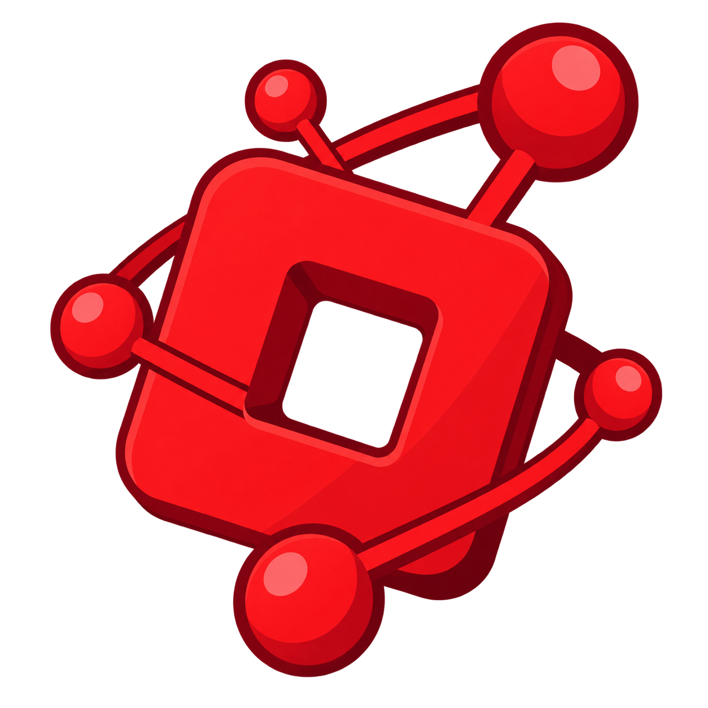

<p align="center">
  
</p>

<h1 align="center">RoGraph</h1>

<p align="center">
  <strong>A local-first knowledge graph for Roblox Studio projects.</strong><br />
  See how your scripts, services, remotes, data stores, tags, and attributes connect.
</p>

<p align="center">
  <a href="https://create.roblox.com/store/asset/96093162457944/RoGraph"><strong>Install the Roblox Studio Plugin</strong></a>
  &nbsp;·&nbsp;
  <a href="#quick-start">Quick Start</a>
  &nbsp;·&nbsp;
  <a href="#connect-an-ai-agent">Connect an AI Agent</a>
</p>

---

RoGraph indexes the meaningful structure of an open Roblox place, stores it locally in SQLite, and gives you three ways to explore it:

| Explore visually | Query locally | Give context to AI |
| --- | --- | --- |
| Interactive graph at `localhost` | FastAPI graph and search API | Read-only MCP server |

## What RoGraph understands

- `require()` dependencies and common instance references
- Roblox services and DataModel hierarchy
- RemoteEvents and RemoteFunctions
- DataStore reads and writes
- CollectionService tags and instance attributes
- Live Studio changes, including scripts, names, parents, tags, and attributes
- Graph intelligence: coupling indicators, relationship communities, and highly connected nodes

RoGraph is intentionally **local-first** and **read-only**. The graph database stays on your machine, the bridge binds to `127.0.0.1` by default, and MCP tools inspect project context without changing Studio or source code.

## Install the Studio plugin

Install RoGraph directly from the official Creator Store:

> [**Get RoGraph for Roblox Studio →**](https://create.roblox.com/store/asset/96093162457944/RoGraph)

After installation, start the backend, open your place, and choose **RoGraph → Index Project**. The first successful index creates the graph; later meaningful Studio edits are sent automatically after a short debounce.

For plugin-source development, see [roblox-plugin/README.md](roblox-plugin/README.md).

## Quick start

### 1. Start the local backend

```powershell
uv sync --extra dev
uv run roblox-graph serve
```

Open [http://127.0.0.1:8765](http://127.0.0.1:8765) for the graph viewer, or [the API docs](http://127.0.0.1:8765/docs) for the HTTP API.

### 2. Index your place

In Roblox Studio, open the RoGraph plugin and select **Index Project**. RoGraph stores the project graph in `.data/graph.db` and keeps different saved places separate by Place ID.

### 3. Explore the graph

Use the viewer to search scripts, filter node and edge types, inspect source previews, and follow relationships. The viewer refreshes when the Studio bridge reports a graph update.

## Connect an AI agent

RoGraph includes a read-only stdio MCP server. Start it manually with:

```powershell
uv run roblox-graph mcp
```

For Codex, add it as an MCP server in Settings, or configure it in `~/.codex/config.toml`:

```toml
[mcp_servers.rograph]
command = "uv"
args = ["run", "roblox-graph", "mcp"]
cwd = "C:\\path\\to\\RoGraph"
```

The agent can search projects, inspect scripts, trace dependencies, find remote/DataStore/tag/attribute usage, examine subgraphs, and retrieve architecture summaries. It cannot mutate the graph or your Studio place through RoGraph.

## Useful commands

```powershell
uv run roblox-graph serve    # local API and graph viewer
uv run roblox-graph mcp      # read-only MCP server over stdio
uv run roblox-graph stats    # persisted graph counts
uv run roblox-graph doctor   # verify local database setup
uv run pytest                # test suite
```

## How live updates work

```text
Roblox Studio change
        ↓
RoGraph plugin detects a meaningful update
        ↓
Local FastAPI bridge re-indexes the affected node
        ↓
SQLite graph updates and the viewer refreshes
```

RoGraph analyzes direct, statically resolvable patterns and records line numbers and confidence on generated edges. Dynamic expressions are reported as warnings instead of guessed relationships.

## Project boundaries

This MVP does not automatically edit scripts, execute arbitrary Studio commands, use cloud storage, or create AI-generated code changes. It is a map for understanding your Roblox project before you make changes.

For implementation details, see [docs/architecture.md](docs/architecture.md).
